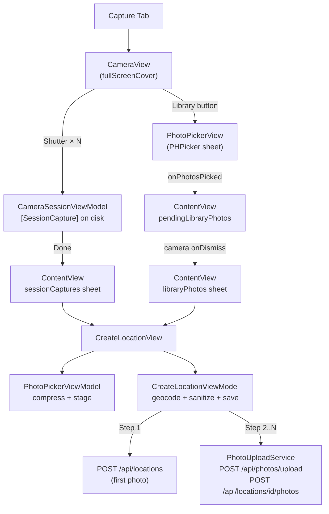

# iOS Photo Upload Pipeline — Review Summary

## What I Reviewed

I read every file in the capture pipeline end-to-end:

- **Entry point:** [ContentView.swift](file:///Users/rodczaro/Desktop/00-Vibecode/fotolokashen-ios/fotolokashen/fotolokashen/ContentView.swift) — tab routing, `fullScreenCover` for camera, sheets for create form
- **Camera path:** [CameraView](file:///Users/rodczaro/Desktop/00-Vibecode/fotolokashen-ios/fotolokashen/fotolokashen/Views/CameraView.swift), [CameraSessionViewModel](file:///Users/rodczaro/Desktop/00-Vibecode/fotolokashen-ios/fotolokashen/fotolokashen/Services/Camera/CameraSessionViewModel.swift), [SessionCapture](file:///Users/rodczaro/Desktop/00-Vibecode/fotolokashen-ios/fotolokashen/fotolokashen/Services/Photo/SessionCapture.swift)
- **Library path:** [PhotoPickerView](file:///Users/rodczaro/Desktop/00-Vibecode/fotolokashen-ios/fotolokashen/fotolokashen/Views/PhotoPickerView.swift), [PhotoPickerViewModel](file:///Users/rodczaro/Desktop/00-Vibecode/fotolokashen-ios/fotolokashen/fotolokashen/Views/PhotoPickerViewModel.swift)
- **Shared form:** [CreateLocationView](file:///Users/rodczaro/Desktop/00-Vibecode/fotolokashen-ios/fotolokashen/fotolokashen/Views/CreateLocationView.swift), [CreateLocationViewModel](file:///Users/rodczaro/Desktop/00-Vibecode/fotolokashen-ios/fotolokashen/fotolokashen/Services/CreateLocation/CreateLocationViewModel.swift)
- **Pipeline services:** [PhotoPipelineCoordinator](file:///Users/rodczaro/Desktop/00-Vibecode/fotolokashen-ios/fotolokashen/fotolokashen/Services/PhotoPipeline/PhotoPipelineCoordinator.swift), [PhotoUploadQueue](file:///Users/rodczaro/Desktop/00-Vibecode/fotolokashen-ios/fotolokashen/fotolokashen/Services/PhotoPipeline/PhotoUploadQueue.swift), [PhotoCompressionService](file:///Users/rodczaro/Desktop/00-Vibecode/fotolokashen-ios/fotolokashen/fotolokashen/Services/PhotoPipeline/PhotoCompressionService.swift), [PhotoSelectionService](file:///Users/rodczaro/Desktop/00-Vibecode/fotolokashen-ios/fotolokashen/fotolokashen/Services/PhotoPipeline/PhotoSelectionService.swift)
- **Upload:** [PhotoUploadService](file:///Users/rodczaro/Desktop/00-Vibecode/fotolokashen-ios/fotolokashen/fotolokashen/Services/Photo/PhotoUploadService.swift), [EXIFExtractor](file:///Users/rodczaro/Desktop/00-Vibecode/fotolokashen-ios/fotolokashen/fotolokashen/Services/Photo/EXIFExtractor.swift), [PhotoPipelineModels](file:///Users/rodczaro/Desktop/00-Vibecode/fotolokashen-ios/fotolokashen/fotolokashen/Services/Photo/PhotoPipelineModels.swift)
- **UI:** [PhotoGridView](file:///Users/rodczaro/Desktop/00-Vibecode/fotolokashen-ios/fotolokashen/fotolokashen/Views/PhotoGridView.swift), [GPSSpreadAnalyzer](file:///Users/rodczaro/Desktop/00-Vibecode/fotolokashen-ios/fotolokashen/fotolokashen/Services/Photo/GPSSpreadAnalyzer.swift)
- **Reference:** [PHOTO_UPLOAD_ARCHITECTURE.md](file:///Users/rodczaro/Desktop/00-Vibecode/Direct-Video-Uploader/PHOTO_UPLOAD_ARCHITECTURE.md) (Photo-Fixer)

---

## Architecture Since v1.4.1

---

## Key Findings: Why Library Path Feels Buggy

### 🔴 High Severity

| Issue | What the user sees | Root cause |
|-------|-------------------|------------|
| **Slow photo loading** (L1) | 3-8 second freeze after picking photos, no progress indicator | Sequential `for` loop loading each `PHPickerResult` one at a time |
| **Photos don't appear** (L3) | CreateLocationView opens with empty photo grid | PHPicker dismisses immediately; photo loading runs async; if user interacts with camera before loading finishes, wrong sheet can open |

### 🟡 Medium Severity

| Issue | What the user sees | Root cause |
|-------|-------------------|------------|
| **Double compression** (L2) | Extra processing delay | JPEG photos compressed at pick time AND again by PhotoPickerViewModel |
| **Abrupt camera dismiss** (C5) | Camera appears to "crash" when picking library photos | Camera must fully dismiss before CreateLocationView can present |
| **Missing camera EXIF** (C2) | Camera photos show no ISO/shutter/aperture on server | CameraService delivers UIImage instead of raw photo data; EXIF lost in conversion |

---

## Fix Priority

> [!IMPORTANT]
> **Phase A (Library path — do first):** Fixes L1, L2, L3, L5. These are the bugs that make the experience feel broken.
>
> **Phase B (Camera path):** Fixes C2, C5, adds camera toggle + flash.
>
> **Phase C (Pipeline activation):** Enable the new `PhotoPipelineCoordinator` as default for concurrent uploads + retry.

---

## Photo-Fixer Comparison

The [PHOTO_UPLOAD_ARCHITECTURE.md](file:///Users/rodczaro/Desktop/00-Vibecode/Direct-Video-Uploader/PHOTO_UPLOAD_ARCHITECTURE.md) reference was reviewed. The portable components from fotolokashen (12 files listed in §7.1 of pipeline.md) can be reused directly. Photo-Fixer adds auth, Lightroom/exiftool integration, RAW format support, and delivery notifications — all outside fotolokashen's scope.

---

## Updated Pipeline Document

The full updated document is at [pipeline.md](file:///Users/rodczaro/Desktop/00-Vibecode/fotolokashen-ios/pipeline.md) and covers:

1. **Architecture scorecard** — updated scores reflecting Phase 2a work
2. **File inventory** — every file mapped to its pipeline role
3. **Path A walkthrough** — Camera → Form → Save (end-to-end)
4. **Path B walkthrough** — Photo Library → Form → Save (end-to-end)
5. **Bug diagnosis** — 5 camera issues, 5 library issues with root causes
6. **Save pipeline** — shared upload flow with API endpoints
7. **Reusable template** — portable components + app-specific wiring guide
8. **Photo-Fixer comparison** — what it adds beyond the base template
