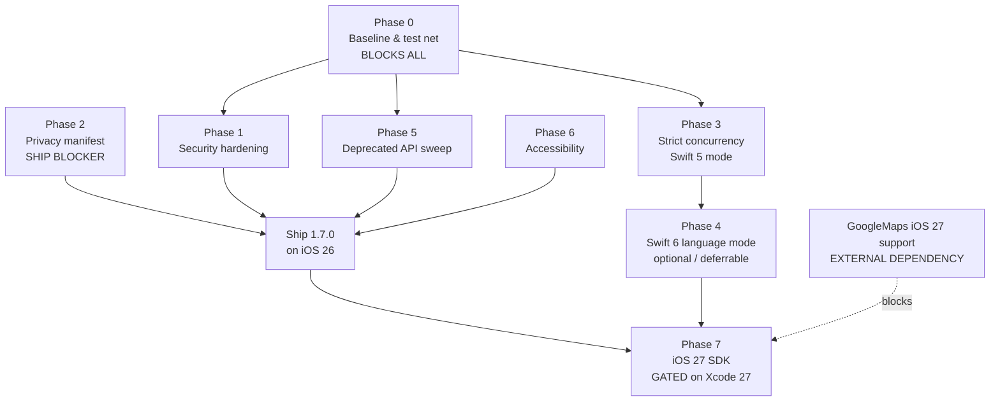

# iOS 27 Readiness Evaluation — fotolokashen iOS

**Last updated:** September 20, 2026 — 9:35 PM
**Version assessed:** 1.6.0 (build 57)
**Scope:** Research and analysis only. No source files were modified during this evaluation.
**Paths:** All file paths in this document are relative to the `fotolokashen-ios` repository root.

Planning and Readiness NOTE FROM Rod:

- Need SF Symbol Fallbacks up to iPhone 15/iOS 17 (current release 26.6+, lowest Apple Supported iOS is 18.0)
- Moving SF Symbol references to a centralized location for easier fallback management (if #available(iOS 17, _)if #available(iOS 17, _) { use new symbol } else { use fallback }).

Check Exsistence at Runtime; use `UIImage(systemName:)` and verify it returns non-nil before using the symbol.

Check Font existence at runtime; use `UIFont(name:size:)` and verify it returns non-nil before using the font.

**Update (Sept 21, 2026):** DB-1's server fix (placeId-based Location dedup) was **reverted** — the same physical place is legitimately saved multiple times for different events/stories, so `placeId` cannot be used as a uniqueness key. Root cause reassessed as a UX issue: `LocationDetailView` exposed a standalone "change visibility" menu that called `LocationStore.updateLocation` directly, bypassing the Edit Location flow entirely. Per Rod: **visibility changes must only happen through Edit Location**, alongside the location's other UserSave fields. Fixed by moving the visibility control into `EditLocationViewModel`/`EditLocationView` (a `Picker` next to Favorite, included in the same `saveChanges()` PATCH) and converting `LocationDetailView`'s visibility row to a read-only badge. `LocationDetailViewModel.changeVisibility`/`isSavingVisibility` removed (no longer had any call site). **DB-1 is downgraded to "root cause unconfirmed"** — the duplicate-row mechanism itself was never conclusively reproduced; this UX fix removes one plausible contributing factor (a second, independent write path for the same field) but is not proven to be the sole cause.

---

## Table of Contents

1. [Executive Summary](#executive-summary)
2. [Verified Baseline](#verified-baseline)
3. [Findings Table](#findings-table)
4. [Phased Plan](#phased-plan)
5. [Open Questions / MUST VERIFY](#open-questions--must-verify-against-ios-27-sdk)
6. [What Is Already Good](#what-is-already-good)
7. [Recommended Sequencing](#recommended-sequencing)

---

## Executive Summary

**Overall verdict: NOT READY — but the blocking work is almost entirely iOS-27-independent.**

Not a single iOS 27 API could be evaluated against the SDK, because **Xcode 27 is not installed**. That turns out to be the less important half of the problem. The codebase has **four hard blockers that exist today**, independent of any future OS:

1. **No `PrivacyInfo.xcprivacy` anywhere in the repo.** This is a _current_ App Store submission blocker, not a future one. The app collects email, name, precise location, photos, and user content.
2. **The OAuth2 authorization flow has no `state` parameter and no callback-origin binding**, while `.onOpenURL` will route _any_ externally-opened `fotolokashen://oauth-callback?code=…` into a live token exchange. This is an authorization-code-injection surface.
3. **Keychain tokens are stored at `.whenUnlocked`, not `…ThisDeviceOnly`** — refresh tokens are restorable to a different device from an encrypted backup.
4. **No regression net.** UI tests are unmodified Xcode boilerplate and currently fail to build. Migrating a 108-file app to a new OS major with zero end-to-end coverage is the single biggest schedule risk here.

**The good news:** concurrency posture is much better than the `SWIFT_VERSION = 5.0` setting suggests. The project already runs `SWIFT_DEFAULT_ACTOR_ISOLATION = MainActor` + `SWIFT_APPROACHABLE_CONCURRENCY = YES`, uses `actor` correctly in the new photo pipeline, and already handles `CLLocationManagerDelegate` with explicit `nonisolated`. **Swift 6 language mode is a days-not-weeks job, concentrated in one file** (`CameraService.swift`).

Also good: exactly **one** file exceeds the project's 800-line guideline (`AuthService.swift` at 876). That is unusually disciplined for a codebase this size.

The dominant _external_ risk is **GoogleMaps 10.8.0**, a binary xcframework. If it needs a vendor rebuild for iOS 27, no amount of local work unblocks you.

> **The single most important scheduling insight:** roughly 90% of the readiness work is verifiable and shippable _today_. Waiting for Xcode 27 to start would be the wrong call — arriving at Phase 7 with a hardened, warning-free, well-tested codebase turns the actual SDK migration from a multi-week unknown into a short verification pass.

---

## Verified Baseline

| Item                             | Value                                                         |
| -------------------------------- | ------------------------------------------------------------- |
| Xcode installed                  | 26.6 (Build 17F113) — **Xcode 27 / iOS 27 SDK NOT installed** |
| `IPHONEOS_DEPLOYMENT_TARGET`     | 17.0                                                          |
| `SWIFT_VERSION`                  | 5.0 (Swift 5 language mode, **not** Swift 6)                  |
| `SWIFT_DEFAULT_ACTOR_ISOLATION`  | MainActor                                                     |
| `SWIFT_APPROACHABLE_CONCURRENCY` | YES                                                           |
| `SWIFT_STRICT_CONCURRENCY`       | **Not set** (defaults to `minimal`)                           |
| `ENABLE_USER_SCRIPT_SANDBOXING`  | YES                                                           |
| Version                          | `MARKETING_VERSION` 1.6.0 / `CURRENT_PROJECT_VERSION` 57      |
| Swift sources                    | 108 files, 21,887 lines                                       |
| Privacy manifest                 | **None found**                                                |
| ATS                              | `NSAllowsLocalNetworking = true` in shared `Info.plist`       |

**SPM dependencies (pinned):**

| Package                   | Version       | Distribution       | Risk     |
| ------------------------- | ------------- | ------------------ | -------- |
| GoogleMaps `ios-maps-sdk` | 10.8.0        | Binary xcframework | **High** |
| GoogleMapsUtils           | 7.1.0         | Source             | Medium   |
| KeychainAccess            | 4.2.2 (~2022) | Source             | Medium   |
| Kingfisher                | 8.8.1         | Source             | Low      |

**Largest files:** `AuthService.swift` (876), `LocationDetailView.swift` (714), `AccountSecurityView.swift` (649), `LocationListView.swift` (578), `CameraService.swift` (556), `MapView.swift` (495), `Location.swift` (493), `ContentView.swift` (458).

---

## Findings Table

| ID       | Area           | Sev                             | Finding                                                                                                                                                                                                                                                                                                                                                                                                                                                                                                                                                                                                                                                                                | Evidence                                                                                                                                                                                                                                                                                                                              | Recommendation                                                                                                                                                                                                                                                                                                                                                                                                                                                    |
| -------- | -------------- | ------------------------------- | -------------------------------------------------------------------------------------------------------------------------------------------------------------------------------------------------------------------------------------------------------------------------------------------------------------------------------------------------------------------------------------------------------------------------------------------------------------------------------------------------------------------------------------------------------------------------------------------------------------------------------------------------------------------------------------- | ------------------------------------------------------------------------------------------------------------------------------------------------------------------------------------------------------------------------------------------------------------------------------------------------------------------------------------- | ----------------------------------------------------------------------------------------------------------------------------------------------------------------------------------------------------------------------------------------------------------------------------------------------------------------------------------------------------------------------------------------------------------------------------------------------------------------- |
| **S-1**  | Security       | **Critical**                    | OAuth authorize request omits the `state` parameter; the callback handler never validates one. The `AuthorizationRequest` struct _defines_ `state` but it is unused dead code.                                                                                                                                                                                                                                                                                                                                                                                                                                                                                                         | `AuthService.swift:225-233`, `:765-785`                                                                                                                                                                                                                                                                                               | Generate a CSPRNG `state`, send it, store it alongside `codeVerifier`, reject callbacks whose `state` does not match exactly once.                                                                                                                                                                                                                                                                                                                                |
| **S-2**  | Security       | **Critical**                    | Any app or Safari page can open `fotolokashen://oauth-callback?code=…`. `DeepLinkManager.handleURL` returns `false` for that host, so `.onOpenURL` forwards it straight to `handleCallback` → `exchangeCodeForTokens`. If the user started and abandoned a login, `codeVerifier` is still populated, so the exchange proceeds with an attacker-supplied code.                                                                                                                                                                                                                                                                                                                          | `fotolokashenApp.swift:105-113`, `DeepLinkManager.swift:76-79`, `AuthService.swift:555-563`                                                                                                                                                                                                                                           | Fixed by S-1. Additionally: only accept OAuth callbacks delivered through the `ASWebAuthenticationSession` completion handler, and clear `codeVerifier`/`codeChallenge` whenever the session ends for any reason.                                                                                                                                                                                                                                                 |
| **S-3**  | Security       | **High**                        | Keychain items use `.accessibility(.whenUnlocked)` (`kSecAttrAccessibleWhenUnlocked`), which is **not** device-bound. Access + refresh tokens are included in encrypted backups and restorable to another device.                                                                                                                                                                                                                                                                                                                                                                                                                                                                      | `KeychainService.swift:26-28`                                                                                                                                                                                                                                                                                                         | Change to `.afterFirstUnlockThisDeviceOnly`. **This is a migration** — existing items must be deleted and re-written or reads fail silently, logging every user out. Ship with a one-time re-auth path.                                                                                                                                                                                                                                                           |
| **S-4**  | Security       | **High**                        | `NSAllowsLocalNetworking = true` is in the shared `Info.plist`, so it applies to Release builds too. No runtime guard ensures a Release build's `backendBaseURL` is HTTPS; `ConfigLoader` prefers the xcconfig-injected value with no scheme validation.                                                                                                                                                                                                                                                                                                                                                                                                                               | `Info.plist:17-21`, `Debug.xcconfig:17`, `ConfigLoader.swift:35-43`                                                                                                                                                                                                                                                                   | Drive the ATS key from an xcconfig variable so it is `false` in Release. Add a Release-only HTTPS scheme assertion in `ConfigLoader.backendURL`.                                                                                                                                                                                                                                                                                                                  |
| **S-5**  | Security       | **High**                        | `DataManager` hard-crashes on `ModelContainer` init failure. A SwiftData store-migration failure on a new OS major — precisely the iOS 27 scenario — becomes an unrecoverable launch crash for every user.                                                                                                                                                                                                                                                                                                                                                                                                                                                                             | `DataManager.swift:57`                                                                                                                                                                                                                                                                                                                | Catch the failure, delete the local store (it is a _cache_ of server data), and rebuild. Never `fatalError` on a recoverable cache.                                                                                                                                                                                                                                                                                                                               |
| **S-6**  | Security       | Medium                          | Universal Link host check uses substring matching: `host.contains("fotolokashen.com")` also matches `fotolokashen.com.attacker.test`. Impact is limited (sets a local `Int` only), but the check is wrong.                                                                                                                                                                                                                                                                                                                                                                                                                                                                             | `DeepLinkManager.swift:83`                                                                                                                                                                                                                                                                                                            | Exact match against an allowlist: `["fotolokashen.com", "www.fotolokashen.com"]`.                                                                                                                                                                                                                                                                                                                                                                                 |
| **S-7**  | Security       | Medium                          | `autoLoginToken` extracted from `fotolokashen://email-verified?token=…` is accepted from **any** caller and immediately exchanged for a full token pair. Only server-side single-use enforcement protects this.                                                                                                                                                                                                                                                                                                                                                                                                                                                                        | `DeepLinkManager.swift:55-67`, `AuthService.swift:640-700`                                                                                                                                                                                                                                                                            | **MUST VERIFY** the web backend enforces one-time use, ≤15 min TTL, and IP/UA binding. Add a client-side format check before exchange.                                                                                                                                                                                                                                                                                                                            |
| **S-8**  | Security       | Medium                          | DEBUG logging emits the PKCE challenge, the authenticated user's email, full API response bodies (500-char preview), and exact GPS coordinates. All correctly `#if DEBUG`-gated, but `dlog` writes with `privacy: .public` to the unified log.                                                                                                                                                                                                                                                                                                                                                                                                                                         | `AuthService.swift:217`, `:553`; `APIClient.swift:302-308`; `DebugLog.swift:26`; `LocationManager.swift:77-78`                                                                                                                                                                                                                        | Switch `dlog` interpolation to `privacy: .private` by default with explicit public opt-in. Redact email/GPS/response bodies even in DEBUG.                                                                                                                                                                                                                                                                                                                        |
| **S-9**  | Security       | Low                             | No certificate pinning; `URLSession` created with no delegate.                                                                                                                                                                                                                                                                                                                                                                                                                                                                                                                                                                                                                         | `APIClient.swift:75-79`                                                                                                                                                                                                                                                                                                               | Acceptable for a first-party HTTPS API with a public CA. Document as accepted risk, or pin only `/api/auth/*`.                                                                                                                                                                                                                                                                                                                                                    |
| **S-10** | Security       | Low                             | Five `fatalError` calls in config/crypto paths turn recoverable conditions into launch crashes.                                                                                                                                                                                                                                                                                                                                                                                                                                                                                                                                                                                        | `ConfigLoader.swift:26`, `:47`, `:72`; `PKCEGenerator.swift:25`                                                                                                                                                                                                                                                                       | Config loader failures are genuine programmer errors (bundled resource) — acceptable. The PKCE one should throw.                                                                                                                                                                                                                                                                                                                                                  |
| **S-11** | Secrets        | Medium                          | The same Google Maps API key appears in three files, two of which are build config. `.gitignore` covers `*.xcconfig` and `Config.plist`, so they _should_ be untracked — but ignore rules do not retroactively untrack.                                                                                                                                                                                                                                                                                                                                                                                                                                                                | `Debug.xcconfig:8`, `Release.xcconfig:8`, `Config.plist:11`, `.gitignore:11`, `:40-42`                                                                                                                                                                                                                                                | **MUST VERIFY** via `git ls-files`. A Maps client key is extractable from any shipped binary regardless — the real control is Google Cloud Console restriction to the iOS bundle ID + Maps SDK for iOS. **MUST VERIFY that restriction is active.**                                                                                                                                                                                                               |
| **P-1**  | Privacy        | **Critical**                    | No `PrivacyInfo.xcprivacy` exists in the repo. Current App Store submission blocker.                                                                                                                                                                                                                                                                                                                                                                                                                                                                                                                                                                                                   | Filesystem search across whole repo                                                                                                                                                                                                                                                                                                   | Author the manifest. See Phase 2.                                                                                                                                                                                                                                                                                                                                                                                                                                 |
| **P-2**  | Privacy        | High                            | Third-party SDK privacy manifests + signatures unverified. Kingfisher and GoogleMaps likely ship them; **KeychainAccess 4.2.2 (~2022) almost certainly does not**, and it is on Apple's "commonly used SDK" list requiring a signature + manifest.                                                                                                                                                                                                                                                                                                                                                                                                                                     | `Package.resolved`                                                                                                                                                                                                                                                                                                                    | **MUST VERIFY** each. Strongest fix: delete the dependency (see D-3).                                                                                                                                                                                                                                                                                                                                                                                             |
| **P-3**  | Privacy        | Low (positive)                  | Zero first-party usage of required-reason APIs — no `UserDefaults`, no `@AppStorage`, no file-timestamp reads, no disk-space or boot-time queries anywhere in app code.                                                                                                                                                                                                                                                                                                                                                                                                                                                                                                                | Grep across all 108 source files returned **zero** matches                                                                                                                                                                                                                                                                            | `NSPrivacyAccessedAPITypes` may legitimately be small. **MUST VERIFY** against Xcode's generated privacy report rather than trusting the grep.                                                                                                                                                                                                                                                                                                                    |
| **C-1**  | Concurrency    | **High**                        | `CameraService` is implicitly `@MainActor` (default isolation) yet captures `self` in ~11 `sessionQueue.async` / `DispatchQueue.main.async` closures. Under Swift 6 each is a `Sendable` capture error. **Single largest migration blocker.**                                                                                                                                                                                                                                                                                                                                                                                                                                          | `CameraService.swift:8`, `:30`, `:146`, `:171`, `:188`, `:214`, `:298`, `:365`, `:457`, `:490`                                                                                                                                                                                                                                        | Split into a `nonisolated` capture-engine type owning `sessionQueue` + AVFoundation state, plus a thin `@MainActor` facade for published state. Correct design regardless of Swift 6.                                                                                                                                                                                                                                                                             |
| **C-2**  | Concurrency    | High                            | Unit and UI test targets **do not** set `SWIFT_DEFAULT_ACTOR_ISOLATION = MainActor`, while the app target does. Tests compile under different isolation rules than the code they test.                                                                                                                                                                                                                                                                                                                                                                                                                                                                                                 | app: `project.pbxproj:495`, `:542`; tests: `:563-566`, `:585-588`                                                                                                                                                                                                                                                                     | Move these settings to the project-level config so every target inherits identically.                                                                                                                                                                                                                                                                                                                                                                             |
| **C-3**  | Concurrency    | Medium                          | `SWIFT_STRICT_CONCURRENCY` is unset (defaults to `minimal`). The real Swift 6 error surface is **completely unmeasured** — nobody has seen the warning count.                                                                                                                                                                                                                                                                                                                                                                                                                                                                                                                          | Absent from `project.pbxproj`                                                                                                                                                                                                                                                                                                         | Set `= complete` and build. This is the _first_ action of the concurrency phase; everything else is guesswork until then.                                                                                                                                                                                                                                                                                                                                         |
| **C-4**  | Concurrency    | Medium                          | Six `NSObject` delegate conformances will have methods inferred `@MainActor` under default isolation, mismatching nonisolated protocol requirements.                                                                                                                                                                                                                                                                                                                                                                                                                                                                                                                                   | `CameraService.swift:483`, `MapView.swift:432`, `PhotoPickerView.swift:32`, `ProfileHeaderComponents.swift:245`, `GeographicClusterAlgorithm.swift:11`, `AuthService.swift:868`                                                                                                                                                       | Follow the pattern already used correctly in `LocationManager.swift:71` — mark each method `nonisolated` and hop with `Task { @MainActor in }`.                                                                                                                                                                                                                                                                                                                   |
| **C-5**  | Perf           | Medium                          | `APIClient` has no explicit isolation, so default MainActor isolation makes it main-actor-bound — **every JSON decode runs on the main thread**. A large locations payload blocks UI.                                                                                                                                                                                                                                                                                                                                                                                                                                                                                                  | `APIClient.swift:25`, `:29`, `:293`                                                                                                                                                                                                                                                                                                   | Mark `nonisolated final class APIClient: Sendable` (stored properties are all `let` and Sendable). Measurable win, low risk.                                                                                                                                                                                                                                                                                                                                      |
| **C-6**  | Concurrency    | Low                             | `@preconcurrency import AVFoundation` masks real Sendable diagnostics.                                                                                                                                                                                                                                                                                                                                                                                                                                                                                                                                                                                                                 | `CameraService.swift:2`                                                                                                                                                                                                                                                                                                               | Remove after C-1.                                                                                                                                                                                                                                                                                                                                                                                                                                                 |
| **C-7**  | Concurrency    | Low (positive)                  | `ConfigLoader`'s `@unchecked Sendable` is genuinely justified — immutable after `init`. Only `@unchecked` in the codebase.                                                                                                                                                                                                                                                                                                                                                                                                                                                                                                                                                             | `ConfigLoader.swift:9`                                                                                                                                                                                                                                                                                                                | Leave as is.                                                                                                                                                                                                                                                                                                                                                                                                                                                      |
| **D-1**  | Dependencies   | **High**                        | GoogleMaps 10.8.0 is a **binary xcframework**. If iOS 27 requires a vendor rebuild, you are fully blocked with no local workaround. It is also the app's primary UI surface.                                                                                                                                                                                                                                                                                                                                                                                                                                                                                                           | `Package.resolved:14-20`                                                                                                                                                                                                                                                                                                              | Track Google's iOS SDK release notes ahead of the migration. Budget schedule contingency for "waiting on Google."                                                                                                                                                                                                                                                                                                                                                 |
| **D-2**  | Dependencies   | Medium                          | GoogleMapsUtils supplies `GMUClusterAlgorithm`/`GMUClusterItem`/`GMUClusterIconGenerator`, subclassed in three places. Source-distributed so patchable, but subclassing third-party ObjC types is brittle across Swift 6 isolation changes.                                                                                                                                                                                                                                                                                                                                                                                                                                            | `GeographicClusterAlgorithm.swift:11`, `:96`; `LocationClusterItem.swift:8`, `:28`, `:50`                                                                                                                                                                                                                                             | Expect `@preconcurrency import GoogleMapsUtils` to be needed. Low effort.                                                                                                                                                                                                                                                                                                                                                                                         |
| **D-3**  | Dependencies   | Medium                          | KeychainAccess 4.2.2 — ~2022, minimal maintenance. The app uses a **tiny** surface: `Keychain(service:)`, `.synchronizable`, `.accessibility`, `set/get/remove`.                                                                                                                                                                                                                                                                                                                                                                                                                                                                                                                       | `KeychainService.swift:1-117`                                                                                                                                                                                                                                                                                                         | **Highest-leverage dependency action: delete it.** ~80 lines of direct `SecItem*` code replaces it, removes a privacy-manifest liability (P-2), and lets you set `kSecAttrAccessibleAfterFirstUnlockThisDeviceOnly` directly (S-3).                                                                                                                                                                                                                               |
| **D-4**  | Dependencies   | Low                             | Kingfisher 8.8.1 — actively maintained, Swift 6 ready, ships a privacy manifest.                                                                                                                                                                                                                                                                                                                                                                                                                                                                                                                                                                                                       | `Package.resolved:31-38`                                                                                                                                                                                                                                                                                                              | No action.                                                                                                                                                                                                                                                                                                                                                                                                                                                        |
| **A-1**  | API surface    | Medium                          | `.navigationBarHidden(true)` — deprecated since iOS 16.                                                                                                                                                                                                                                                                                                                                                                                                                                                                                                                                                                                                                                | `ContentView.swift:147`                                                                                                                                                                                                                                                                                                               | `.toolbar(.hidden, for: .navigationBar)`.                                                                                                                                                                                                                                                                                                                                                                                                                         |
| **A-2**  | API surface    | Medium                          | `UIImagePickerController` still used for avatar/banner, while PHPicker is used elsewhere. Long-standing deprecation and a prime removal candidate.                                                                                                                                                                                                                                                                                                                                                                                                                                                                                                                                     | `ProfileHeaderComponents.swift:245` vs `PhotoPickerView.swift:32`                                                                                                                                                                                                                                                                     | Replace with SwiftUI `PhotosPicker`. Removes a `UIViewControllerRepresentable` and a deprecated delegate.                                                                                                                                                                                                                                                                                                                                                         |
| **A-3**  | API surface    | **Med-High**                    | Eight `DispatchQueue.main.asyncAfter` UI-timing hacks with hardcoded delays (0.1–4.0 s). These "wait and hope" sequences are the classic breakage category on a new OS major, when animation/transaction timing shifts.                                                                                                                                                                                                                                                                                                                                                                                                                                                                | `ContentView.swift:166`, `:222`, `:232`; `CameraView.swift:318`, `:380`, `:385`; `CameraSessionViewModel.swift:50`; `MapView.swift:325`                                                                                                                                                                                               | Replace with explicit state/completion signals. The two in alert buttons exist to dodge a presentation conflict — use `.onDismiss` instead.                                                                                                                                                                                                                                                                                                                       |
| **A-4**  | API surface    | Low                             | `.autocapitalization(.none)` — deprecated since iOS 13.                                                                                                                                                                                                                                                                                                                                                                                                                                                                                                                                                                                                                                | `PeopleSearchView.swift:65`                                                                                                                                                                                                                                                                                                           | `.textInputAutocapitalization(.never)`.                                                                                                                                                                                                                                                                                                                                                                                                                           |
| **A-5**  | API surface    | Low                             | `.foregroundColor` and `CircularProgressViewStyle(tint:)` are soft-deprecated.                                                                                                                                                                                                                                                                                                                                                                                                                                                                                                                                                                                                         | `MapView.swift:76`, `:83`; `PeopleSearchView.swift:64`, `:89`                                                                                                                                                                                                                                                                         | `.foregroundStyle` / `.progressViewStyle(.circular).tint(…)`.                                                                                                                                                                                                                                                                                                                                                                                                     |
| **X-1**  | A11y           | **High**                        | Across **108 Swift files, accessibility modifiers appear in exactly 2 files** (~8 usages total).                                                                                                                                                                                                                                                                                                                                                                                                                                                                                                                                                                                       | `LocationListView.swift:139-141`; `MapPlaceSearchOverlay.swift:18-60`                                                                                                                                                                                                                                                                 | Systematic labeling pass. See Phase 6.                                                                                                                                                                                                                                                                                                                                                                                                                            |
| **X-2**  | A11y           | **High**                        | `ClusteredMapView` wraps `GMSMapView` in a `UIViewRepresentable` with zero accessibility configuration. The app's primary screen is a VoiceOver dead zone.                                                                                                                                                                                                                                                                                                                                                                                                                                                                                                                             | `MapView.swift:192`                                                                                                                                                                                                                                                                                                                   | Provide an accessible list alternative, or expose markers as accessibility elements. **MUST VERIFY** what `GMSMapView` exposes natively.                                                                                                                                                                                                                                                                                                                          |
| **X-3**  | A11y           | High                            | Icon-only buttons with no `accessibilityLabel` — VoiceOver announces the raw SF Symbol name or nothing.                                                                                                                                                                                                                                                                                                                                                                                                                                                                                                                                                                                | `MapView.swift:64-88`; `LocationDetailView.swift:236-243`; `LocationListView.swift:53-56`; `PeopleSearchView.swift:85-91`                                                                                                                                                                                                             | Add `.accessibilityLabel` to every `Image(systemName:)`-only button.                                                                                                                                                                                                                                                                                                                                                                                              |
| **X-4**  | A11y           | Medium                          | Zero `dynamicTypeSize` handling; fixed-dimension frames will clip at large text sizes.                                                                                                                                                                                                                                                                                                                                                                                                                                                                                                                                                                                                 | `MapView.swift:80`; `PermissionsView.swift:86`                                                                                                                                                                                                                                                                                        | Audit at `.accessibility3`. Use `@ScaledMetric` for icon frames.                                                                                                                                                                                                                                                                                                                                                                                                  |
| **X-5**  | A11y           | Medium                          | App Store Accessibility Nutrition Labels require declaring VoiceOver / Dynamic Type support. Current state cannot honestly claim either.                                                                                                                                                                                                                                                                                                                                                                                                                                                                                                                                               | —                                                                                                                                                                                                                                                                                                                                     | Fix X-1..X-4 **before** completing the declaration. Over-claiming is a review risk.                                                                                                                                                                                                                                                                                                                                                                               |
| **T-1**  | Testing        | **Critical**                    | UI tests are unmodified Xcode boilerplate. `testExample` launches and asserts nothing. All three currently fail on a build-products mismatch. Zero regression value.                                                                                                                                                                                                                                                                                                                                                                                                                                                                                                                   | `fotolokashenUITests.swift:26-31`; `fotolokashenUITestsLaunchTests.swift:21-32`                                                                                                                                                                                                                                                       | Fix the scheme/build-products issue first, then write real smoke tests. See Phase 0.                                                                                                                                                                                                                                                                                                                                                                              |
| **T-2**  | Testing        | High                            | Tests are not hermetic. `AuthServiceTests` constructs a real `AuthService`, whose `init` calls `checkAuthStatus()` → real network + real Keychain. `KeychainServiceTests` and `LocationStoreTests` both mutate process-wide singletons. Order-dependent and flaky.                                                                                                                                                                                                                                                                                                                                                                                                                     | `AuthServiceTests.swift:11`; `KeychainServiceTests.swift:6`; `LocationStoreTests.swift:13`                                                                                                                                                                                                                                            | Extend the DI pattern already proven in `APIClient.swift:90` to `AuthService` and `KeychainService`.                                                                                                                                                                                                                                                                                                                                                              |
| **T-3**  | Testing        | High                            | **Zero tests for the two highest-risk security surfaces**: `DeepLinkManager.handleURL` URL parsing and `PKCEGenerator`. Also no test for the authenticated-401-refresh-retry path.                                                                                                                                                                                                                                                                                                                                                                                                                                                                                                     | `APIClientTests.swift:141-154` covers only the inverted case                                                                                                                                                                                                                                                                          | Add these _before_ touching S-1/S-2/S-6 — they are the regression tests for the security fixes.                                                                                                                                                                                                                                                                                                                                                                   |
| **T-4**  | Testing        | Low (positive)                  | `PhotoUploadQueue`, `PhotoCompressionService`, `ImageCompressor`, `APIClient`, and Create/Edit view-model logic have genuinely good coverage, including a well-built `URLProtocol` stub and a programmable FIFO mock.                                                                                                                                                                                                                                                                                                                                                                                                                                                                  | `PhotoUploadQueueTests.swift`; `APIClientTests.swift:170-200`; `MockPhotoUploadService.swift`                                                                                                                                                                                                                                         | Use as the template for expanding coverage.                                                                                                                                                                                                                                                                                                                                                                                                                       |
| **H-1**  | Code health    | Medium                          | `AuthService.swift` at 876 lines is the only file over the 800-line guideline. Mixes PKCE, web-session presentation, callback routing, token exchange, auto-login, refresh single-flight, logout, 5 request models, an error enum, and a presentation-context provider.                                                                                                                                                                                                                                                                                                                                                                                                                | `AuthService.swift`                                                                                                                                                                                                                                                                                                                   | Split: `AuthService` (state) / `OAuthFlowController` / `AuthModels.swift` (~765–860) / `AuthPresentationContextProvider.swift` (~868–876). Last two are pure moves.                                                                                                                                                                                                                                                                                               |
| **H-2**  | Code health    | Medium                          | Two parallel photo pipelines coexist behind `useNewPhotoPipeline`, which is **already `true`**. The legacy `PhotoPickerViewModel` path is live dead weight doubling migration validation surface.                                                                                                                                                                                                                                                                                                                                                                                                                                                                                      | `ConfigLoader.swift:143`; `Config.plist:55-56`; `PhotoPickerViewModel.swift` vs `PhotoPipelineCoordinator.swift`                                                                                                                                                                                                                      | Delete the legacy path and the flag before migration. Pure subtraction — cheapest risk reduction available.                                                                                                                                                                                                                                                                                                                                                       |
| **H-3**  | Code health    | Medium                          | 17 `static let shared` singletons with almost no DI seams. Most services cannot be tested in isolation.                                                                                                                                                                                                                                                                                                                                                                                                                                                                                                                                                                                | `APIClient`, `AuthService`, `KeychainService`, `ConfigLoader`, `LocationStore`, `LocationService`, `LocationRepository`, `LocationGroupService`, `FollowService`, `UserService`, `PlacesService`, `GeocodingService`, `SyncService`, `NetworkMonitor`, `DeepLinkManager`, `ErrorPresenter`, `MapNavigationCoordinator`, `DataManager` | Do **not** do a global DI refactor during an OS migration. Add test-only inits opportunistically as each area gets tested.                                                                                                                                                                                                                                                                                                                                        |
| **H-4**  | Code health    | Low                             | `LocationStore` manually forwards an inner `objectWillChange` — fragile hand-rolled Combine bridge.                                                                                                                                                                                                                                                                                                                                                                                                                                                                                                                                                                                    | `LocationStore.swift:58`                                                                                                                                                                                                                                                                                                              | Resolves naturally if/when migrating to `@Observable`. Do not bundle with the OS migration.                                                                                                                                                                                                                                                                                                                                                                       |
| **H-5**  | Code health    | Low                             | 100% `ObservableObject`/`@Published`; zero `@Observable`. Not a defect, but the largest latent modernization debt.                                                                                                                                                                                                                                                                                                                                                                                                                                                                                                                                                                     | ~30 files                                                                                                                                                                                                                                                                                                                             | Explicitly **out of scope** for iOS 27 readiness. Schedule separately.                                                                                                                                                                                                                                                                                                                                                                                            |
| **DB-1** | Data integrity | **High (reverted, reassessed)** | Reported: saving/re-saving a place created a second, duplicate `Location` row with identical `placeId`/`name`/`address` (confirmed via production DB rows 140/141, "UNGA"). Initial fix attempted `placeId`-based dedup in `POST /api/locations`, but this was **wrong and reverted** — the same physical place is legitimately saved multiple times for different events/stories/years, so `placeId` cannot be treated as unique. Real contributing factor identified: `LocationDetailView` had a standalone visibility-change menu that PATCHed directly via `LocationStore.updateLocation`, bypassing Edit Location — a second, independent write path for the same UserSave field. | `fotolokashen/src/app/api/locations/route.ts` (POST handler, unchanged); `LocationDetailView.swift` (visibility menu, now read-only); `LocationDetailViewModel.swift` (`changeVisibility`/`isSavingVisibility`, removed)                                                                                                              | **FIXED (UX consolidation)**: visibility change now lives only in `EditLocationViewModel`/`EditLocationView` as a `Picker`, included in the same `saveChanges()` PATCH as every other UserSave field. `LocationDetailView`'s visibility control is now read-only. **Root cause of the original duplicate row is still not conclusively proven** — this removes one plausible dual-write-path contributor, but the exact repro sequence was never reproduced live. |
| **DB-2** | Documentation  | Low                             | `MOBILE_API_SCHEMAS.md:104` documents `MapSocialLocation.id` as `UserSave.id (NOT Location.id)`, but the actual `/api/v1/locations/public` and `/friends` handlers both return `id: save.location.id` (i.e. `Location.id`). Doc and code disagree.                                                                                                                                                                                                                                                                                                                                                                                                                                     | `fotolokashen/docs/api/MOBILE_API_SCHEMAS.md:104`; `fotolokashen/src/app/api/v1/locations/public/route.ts`; `fotolokashen/src/app/api/v1/locations/friends/route.ts`                                                                                                                                                                  | Update the doc comment to match actual behavior (`Location.id`), or confirm intended behavior and fix the code — pick one source of truth.                                                                                                                                                                                                                                                                                                                        |

---

## Phased Plan

Each task states its own verification criterion. **Phases 0–6 are all executable today without Xcode 27.**

### Phase 0 — Restore a trustworthy baseline `(BLOCKS EVERYTHING)`

**Goal:** Be able to build, test, and measure. Nothing downstream is meaningful until the test suite runs and the true strict-concurrency error count is known.

| #   | Task                                                                                                                                                                                                                                                                                    | Verify                                                                                                                                                                                               |
| --- | --------------------------------------------------------------------------------------------------------------------------------------------------------------------------------------------------------------------------------------------------------------------------------------- | ---------------------------------------------------------------------------------------------------------------------------------------------------------------------------------------------------- |
| 0.1 | Diagnose and fix the UI-test build-products mismatch. Confirm the UI test target's `TEST_TARGET_NAME`/host-app reference and the scheme's Test action both point at the `fotolokashen` app target.                                                                                      | `xcodebuild test -scheme fotolokashen -destination 'platform=iOS Simulator,name=iPhone 17'` runs all three UI tests to completion (pass or _meaningful_ fail), with no "app bundle not found" error. |
| 0.2 | Replace `testExample` in `fotolokashenUITests.swift` with a real launch smoke test: launch → assert the login screen's primary CTA exists.                                                                                                                                              | Test fails if the login screen does not render. Confirm by temporarily breaking the view.                                                                                                            |
| 0.3 | Create a shared `.xctestplan` with `fotolokashenTests` + `fotolokashenUITests`, committed under `xcshareddata`.                                                                                                                                                                         | Plan appears in the scheme selector; `xcodebuild test -testPlan <name>` succeeds.                                                                                                                    |
| 0.4 | Move `SWIFT_DEFAULT_ACTOR_ISOLATION = MainActor` and `SWIFT_APPROACHABLE_CONCURRENCY = YES` from per-target to the **project-level** Debug/Release configs (`project.pbxproj:372` / `:436`); remove the per-target copies at lines 494–495, 541–542, 563, 585, 605, 625. Fixes **C-2**. | `xcodebuild -showBuildSettings -target fotolokashenTests \| grep SWIFT_DEFAULT_ACTOR_ISOLATION` returns `MainActor`. Same for all four targets.                                                      |
| 0.5 | Set `SWIFT_STRICT_CONCURRENCY = complete` at project level. Build. **Record the exact warning count and per-file distribution. Fix nothing yet.** Fixes **C-3**.                                                                                                                        | A written baseline: total warnings + top-10 files by warning count. This number is the Phase 3 tracking metric.                                                                                      |
| 0.6 | Capture a full `xcodebuild` log and grep for `deprecated`. Record the deprecation baseline.                                                                                                                                                                                             | A list of every deprecation warning with `file:line`. Cross-check against A-1..A-5.                                                                                                                  |

> **Dependencies:** 0.1 blocks 0.2–0.3. 0.4 must precede 0.5, or the baseline is measured under inconsistent isolation rules.

---

### Phase 1 — Security hardening `(depends on Phase 0 for tests)`

**Goal:** Close the auth-flow and token-storage findings. **This phase has nothing to do with iOS 27 and should ship regardless of the migration.**

| #    | Task                                                                                                                                                                                                                                                                                                                                             | Verify                                                                                                                                                                      |
| ---- | ------------------------------------------------------------------------------------------------------------------------------------------------------------------------------------------------------------------------------------------------------------------------------------------------------------------------------------------------ | --------------------------------------------------------------------------------------------------------------------------------------------------------------------------- |
| 1.1  | Write `DeepLinkManagerTests` covering: valid `fotolokashen://location/123`; non-numeric id; `email-verified` with and without token; exact-host Universal Link; and the **spoofed** host `https://fotolokashen.com.attacker.test/shared/1`.                                                                                                      | New test file; the spoof case is red before 1.2, green after.                                                                                                               |
| 1.2  | Fix **S-6**: replace `host.contains("fotolokashen.com")` at `DeepLinkManager.swift:83` with an exact allowlist.                                                                                                                                                                                                                                  | 1.1's spoof test passes.                                                                                                                                                    |
| 1.3  | Write `PKCEGeneratorTests`: verifier length 43–128, base64url charset only (no `+`, `/`, `=`), 1000 generations all unique, challenge == base64url(SHA256(verifier)) against an RFC 7636 §B test vector.                                                                                                                                         | All pass against current implementation (already correct — this locks it in).                                                                                               |
| 1.4  | Fix **S-1**: add CSPRNG `state` to `PKCEGenerator`; send it in the authorize query at `AuthService.swift:225-233`; store next to `codeVerifier`; reject any `oauth-callback` whose `state` does not match. Delete the unused `AuthorizationRequest` struct. **Coordinate with the web app — the Next.js `/login` route must echo `state` back.** | New test: a callback with missing/mismatched `state` sets `errorMessage` and performs **no** token exchange.                                                                |
| 1.5  | Fix **S-2**: clear `codeVerifier`/`codeChallenge`/`state` in **every** `ASWebAuthenticationSession` completion path — cancel, error, and success. In `fotolokashenApp.swift:105-113`, stop routing externally-delivered `oauth-callback` URLs to `handleCallback`.                                                                               | New test: start login → simulate cancel → deliver crafted `oauth-callback?code=X` via `onOpenURL` → assert zero network calls.                                              |
| 1.6  | Fix **S-3**: change `KeychainService.swift:26-28` to `.afterFirstUnlockThisDeviceOnly`. **Add a one-time migration**: attempt a read with the old attribute; if found, delete and re-write with the new one; if re-write fails, clear tokens and force re-login.                                                                                 | Extend `KeychainServiceTests` to assert the stored item's `kSecAttrAccessible` value. Manually: install old build → sign in → upgrade → confirm still signed in.            |
| 1.7  | Fix **S-4**: introduce `ATS_ALLOW_LOCAL_NETWORKING` xcconfig var referenced from `Info.plist:17-21`; `YES` in Debug, `NO` in Release. Add a Release-only HTTPS scheme assertion in `ConfigLoader.backendURL`.                                                                                                                                    | `plutil -p` on the Release `.app`'s Info.plist shows `NSAllowsLocalNetworking = false` or key absent. A Release build pointed at `http://` fails fast with a clear message. |
| 1.8  | Fix **S-5**: wrap `ModelContainer` creation at `DataManager.swift:37-57` in do/catch that deletes the store file and retries once before giving up.                                                                                                                                                                                              | Test: corrupt the store file on disk, launch, assert the app reaches the authenticated root instead of crashing.                                                            |
| 1.9  | Fix **S-8**: change `DebugLog.swift:26` to `privacy: .private` by default. Redact email at `AuthService.swift:553`, PKCE challenge at `:217`, and truncate/redact response bodies at `APIClient.swift:302-308`.                                                                                                                                  | DEBUG build on device; `log stream --predicate 'subsystem == "com.fotolokashen.app"'` shows `<private>` for sensitive fields.                                               |
| 1.10 | Resolve **S-11**: run `git ls-files -- '*.xcconfig' '**/Config.plist'` and `git log --all --oneline -- fotolokashen/Debug.xcconfig`. If the key was ever committed, **rotate it**. Independently confirm the key is restricted to the iOS bundle ID + Maps SDK for iOS.                                                                          | Written confirmation of both tracked-status and API-key restriction state.                                                                                                  |

> **Dependencies:** 1.1→1.2; 1.3→1.4→1.5. Tasks 1.6–1.10 are independent. **1.6 needs careful release sequencing — it is the only task here that can log users out.**

---

### Phase 2 — Privacy manifest & App Store compliance `(parallel with Phase 1)`

**Goal:** Remove the current submission blocker.

| #   | Task                                                                                                                                                                                                                                                                                                                                                                                                                                                                       | Verify                                                                                                                                                                 |
| --- | -------------------------------------------------------------------------------------------------------------------------------------------------------------------------------------------------------------------------------------------------------------------------------------------------------------------------------------------------------------------------------------------------------------------------------------------------------------------------- | ---------------------------------------------------------------------------------------------------------------------------------------------------------------------- |
| 2.1 | Build and generate Xcode's **privacy report** (Product → Archive → Generate Privacy Report) to get the _actual_ required-reason API list rather than relying on source grep. Resolves **P-3**.                                                                                                                                                                                                                                                                             | A concrete list of `NSPrivacyAccessedAPITypes` entries with source attribution per SDK.                                                                                |
| 2.2 | Inspect each SPM checkout for a bundled `PrivacyInfo.xcprivacy`: GoogleMaps, GoogleMapsUtils, KeychainAccess, Kingfisher. Resolves **P-2**.                                                                                                                                                                                                                                                                                                                                | A 4-row table: SDK → manifest Y/N → signed Y/N. Any "N" on Apple's commonly-used-SDK list is a blocker.                                                                |
| 2.3 | Author `fotolokashen/fotolokashen/PrivacyInfo.xcprivacy` and add to the app target's Copy Resources phase. `NSPrivacyCollectedDataTypes` must cover at minimum: **Email Address, Name, User ID, Photos or Videos, Precise Location, Coarse Location, Other User Content** (captions/notes/tags), plus **Product Interaction** if analytics exist. Set `NSPrivacyTracking = false` and empty `NSPrivacyTrackingDomains` unless tracking is actually present. Fixes **P-1**. | File exists, is in target resources, appears in the built `.app`, and the regenerated privacy report matches App Store Connect's questionnaire with no contradictions. |
| 2.4 | If 2.2 finds KeychainAccess lacks a manifest/signature, execute **D-3**: replace with direct `SecItem*` calls. Keep `KeychainService`'s public API byte-identical so no call sites change.                                                                                                                                                                                                                                                                                 | `KeychainServiceTests` passes unchanged. `Package.resolved` no longer lists `keychainaccess`. Combines naturally with 1.6.                                             |
| 2.5 | Confirm `ITSAppUsesNonExemptEncryption = NO` (`project.pbxproj:470`) is still accurate — app uses CryptoKit SHA256 + HTTPS, both exempt.                                                                                                                                                                                                                                                                                                                                   | Written confirmation; no custom crypto found.                                                                                                                          |
| 2.6 | **MUST VERIFY** the web `/login` and `/register` pages reachable inside `ASWebAuthenticationSession` do not offer Google/Facebook/Apple third-party sign-in. If they do, Guideline 4.8 obligations attach to the iOS app.                                                                                                                                                                                                                                                  | Screenshot or DOM inspection of both pages in the iOS flow.                                                                                                            |
| 2.7 | Confirm account deletion meets Guideline 5.1.1(v) — the flow at `AccountSecurityView.swift:32-38` must fully delete server-side, not just deactivate.                                                                                                                                                                                                                                                                                                                      | End-to-end test against staging: delete → confirm account cannot be recovered by re-login.                                                                             |

---

### Phase 3 — Strict concurrency clean-up (still Swift 5 mode) `(depends on 0.4, 0.5)`

**Goal:** Drive the Phase 0.5 baseline warning count to zero **while still in Swift 5 language mode**, so every fix is independently shippable and revertable.

| #   | Task                                                                                                                                                                                                                                                                                                                                                                                                                                                               | Verify                                                                                                                                                                                                             |
| --- | ------------------------------------------------------------------------------------------------------------------------------------------------------------------------------------------------------------------------------------------------------------------------------------------------------------------------------------------------------------------------------------------------------------------------------------------------------------------ | ------------------------------------------------------------------------------------------------------------------------------------------------------------------------------------------------------------------ |
| 3.1 | Execute **H-2** first: delete the legacy `PhotoPickerViewModel` path, the `useNewPhotoPipeline` flag (`ConfigLoader.swift:143`), and its Config.plist entry. Doing this _before_ the concurrency work means never fixing warnings in code about to be deleted.                                                                                                                                                                                                     | App builds; photo capture → compress → upload still works end-to-end; warning count drops. Re-run 0.5's measurement.                                                                                               |
| 3.2 | Fix **C-5**: mark `nonisolated final class APIClient: Sendable` (`APIClient.swift:25`). All stored properties are already `let` and Sendable. Remove the now-unnecessary `await MainActor.run` at `:61-63` only if it still compiles cleanly.                                                                                                                                                                                                                      | `APIClientTests` passes unchanged. Instruments Time Profiler on a locations fetch — JSON decode no longer on main thread.                                                                                          |
| 3.3 | Fix **C-4**: add explicit `nonisolated` to every delegate method in the six conformances, following `LocationManager.swift:71`.                                                                                                                                                                                                                                                                                                                                    | Warning count drops; camera capture, map marker taps, photo picking, avatar picking all still work manually.                                                                                                       |
| 3.4 | Fix **C-1** — the main effort. Split `CameraService.swift` into (a) `nonisolated final class CameraCaptureEngine: @unchecked Sendable` owning `captureSession`, `photoOutput`, `sessionQueue`, `videoDeviceInput` and all AVFoundation config, with the documented invariant _"all mutable state touched only on sessionQueue"_; and (b) `@MainActor final class CameraService: ObservableObject` holding only `@Published` state, forwarding via `async` methods. | Zero strict-concurrency warnings in both files. Manual device test: permission prompt, session start, zoom, flash cycle, front/back switch, exposure bias, capture with EXIF preserved. Each file under 400 lines. |
| 3.5 | Fix **C-6**: remove `@preconcurrency` from `import AVFoundation` (`CameraService.swift:2`) after 3.4. Add `@preconcurrency import GoogleMaps`/`GoogleMapsUtils` only if the build demands it (**D-2**).                                                                                                                                                                                                                                                            | Build warning-free. If `@preconcurrency` is still required, record _which_ symbol forced it.                                                                                                                       |
| 3.6 | Clear residual warnings in view files, working down 0.5's top-10 list.                                                                                                                                                                                                                                                                                                                                                                                             | `SWIFT_STRICT_CONCURRENCY = complete` produces **zero** warnings across all four targets.                                                                                                                          |

> **Dependencies:** 3.1 before everything (deletes code). **3.4 is the critical path and the riskiest single task in the plan** — requires physical-device testing.

---

### Phase 4 — Swift 6 language mode `(hard dependency on Phase 3 at zero warnings)`

| #   | Task                                                                                                                                                                                                    | Verify                                                                                                                            |
| --- | ------------------------------------------------------------------------------------------------------------------------------------------------------------------------------------------------------- | --------------------------------------------------------------------------------------------------------------------------------- |
| 4.1 | Set `SWIFT_VERSION = 6.0` at project level. Build all four targets.                                                                                                                                     | Record the error count. If Phase 3 finished clean, this should be small.                                                          |
| 4.2 | Resolve remaining errors. Do **not** reach for `@unchecked Sendable` or `nonisolated(unsafe)` as a shortcut — the codebase currently has exactly one `@unchecked` and that discipline is worth keeping. | Clean build. `grep -rn "@unchecked Sendable\|nonisolated(unsafe)"` returns at most 2 hits, each with a written invariant comment. |
| 4.3 | Full test-suite run + manual regression: login, token refresh (force-expire), deep links, map, camera, photo upload, profile edit, logout.                                                              | All tests pass. Manual checklist complete on a physical device.                                                                   |

> **Checkpoint:** Swift 6 language mode is _not_ a prerequisite for running on iOS 27. If the schedule tightens, **Phase 4 can be deferred** — Phases 1, 2, 5, 6 cannot.

---

### Phase 5 — Deprecated API & timing-fragility sweep `(parallel with Phases 3–4)`

| #   | Task                                                                                                                                                                                                                                                                                                                                             | Verify                                                                                                                                      |
| --- | ------------------------------------------------------------------------------------------------------------------------------------------------------------------------------------------------------------------------------------------------------------------------------------------------------------------------------------------------ | ------------------------------------------------------------------------------------------------------------------------------------------- |
| 5.1 | Fix **A-1**: `.navigationBarHidden(true)` → `.toolbar(.hidden, for: .navigationBar)` at `ContentView.swift:147`.                                                                                                                                                                                                                                 | Login screen still renders with no nav bar. Deprecation warning gone.                                                                       |
| 5.2 | Fix **A-4**/**A-5**: `.autocapitalization` → `.textInputAutocapitalization`; `.foregroundColor` → `.foregroundStyle`; `CircularProgressViewStyle(tint:)` → `.progressViewStyle(.circular).tint(…)`.                                                                                                                                              | Visual diff shows no rendering change. Deprecation count from 0.6 drops correspondingly.                                                    |
| 5.3 | Fix **A-2**: replace `UIImagePickerController` at `ProfileHeaderComponents.swift:245` with SwiftUI `PhotosPicker`. Deletes a `UIViewControllerRepresentable` and one `NSObject` delegate (also helps **C-4**).                                                                                                                                   | Avatar and banner upload both still work. `ImagePicker` type fully removed.                                                                 |
| 5.4 | Fix **A-3** — highest iOS-27-specific value in this phase. Replace all 8 `asyncAfter` timing hacks with deterministic signals. The two in alert buttons (`ContentView.swift:222`, `:232`) should use the alert's dismissal instead of a 0.3 s guess; the camera ones (`CameraView.swift:380`, `:385`) should key off actual session-ready state. | `grep -rn "asyncAfter" fotolokashen/fotolokashen` returns **zero** hits. Manual test of each affected flow on the slowest supported device. |
| 5.5 | Fix **H-1**: mechanically extract lines ~765–860 of `AuthService.swift` into `AuthModels.swift` and ~868–876 into `AuthPresentationContextProvider.swift`. While there, fix the `.first` scene selection to filter for `.foregroundActive` (`AuthService.swift:869-872`).                                                                        | `AuthService.swift` drops below 800 lines. No behavior change. Login works on a device with multiple scenes (iPad Stage Manager).           |

---

### Phase 6 — Accessibility `(parallel; gated before any Nutrition Label declaration)`

| #   | Task                                                                                                                                                                                                                         | Verify                                                                                                                      |
| --- | ---------------------------------------------------------------------------------------------------------------------------------------------------------------------------------------------------------------------------- | --------------------------------------------------------------------------------------------------------------------------- |
| 6.1 | Fix **X-3**: add `.accessibilityLabel` to every icon-only control. Start with the four confirmed sites, then sweep all `Image(systemName:)` inside `Button`/`ToolbarItem` across `Views/`.                                   | VoiceOver pass on Map, Locations, Detail, People — every control announces a human-readable name.                           |
| 6.2 | Fix **X-2**: `ClusteredMapView` (`MapView.swift:192`). At minimum add `.accessibilityLabel` + `.accessibilityHint` on the representable and ensure the Locations list is a discoverable equivalent path to the same content. | VoiceOver reaches and can describe the map region; a user can accomplish "open a location" without sighted map interaction. |
| 6.3 | Fix **X-4**: audit at `.accessibility3` and `.accessibility5`. Convert fixed icon frames (`MapView.swift:80`, `PermissionsView.swift:86`) to `@ScaledMetric`.                                                                | Screenshots at `.accessibility5` show no clipped or overlapping text on the 6 largest views.                                |
| 6.4 | Run Xcode's **Accessibility Inspector audit** on every top-level screen; resolve all findings.                                                                                                                               | Zero audit findings on Map, Locations, Location Detail, Profile, People, Camera, Create Location.                           |
| 6.5 | Only after 6.1–6.4: complete the App Store Accessibility Nutrition Label declaration (**X-5**).                                                                                                                              | Declared capabilities each demonstrable in a recorded VoiceOver walkthrough.                                                |

---

### Phase 7 — Actual iOS 27 SDK migration `(HARD GATE: requires Xcode 27)`

**Nothing in this phase can start before Xcode 27 is installed. Everything above can.**

| #   | Task                                                                                                                                                                                                                                                                     | Verify                                                                                                             |
| --- | ------------------------------------------------------------------------------------------------------------------------------------------------------------------------------------------------------------------------------------------------------------------------ | ------------------------------------------------------------------------------------------------------------------ |
| 7.1 | Install Xcode 27. Build the Phase-6 codebase against the iOS 27 SDK with deployment target unchanged at 17.0. Record every new error and warning.                                                                                                                        | A concrete, evidence-based delta list — replacing all current speculation.                                         |
| 7.2 | Read Apple's iOS 27 release notes and Deprecations documentation end-to-end. Cross-reference against the 0.6 deprecation baseline.                                                                                                                                       | A written list of confirmed removals/behavior changes affecting this app.                                          |
| 7.3 | Verify **D-1**: does GoogleMaps 10.8.0 (or then-latest) build and run against the iOS 27 SDK? **This is the go/no-go gate.**                                                                                                                                             | Map renders, clustering works, marker taps fire on iOS 27 simulator + device. If not, escalate to Google and halt. |
| 7.4 | Verify the other three SPM packages build under the new SDK. Update `Package.resolved` only with deliberate, tested version bumps.                                                                                                                                       | Clean build; full test suite green.                                                                                |
| 7.5 | Run the full regression suite + manual checklist on an iOS 27 device. Pay specific attention to: `ASWebAuthenticationSession` presentation, Keychain accessibility behavior, `PHPickerViewController`, SwiftData store migration, and deep-link/Universal-Link delivery. | Checklist complete. Any SwiftData migration issue is caught by the 1.8 recovery path rather than a crash.          |
| 7.6 | Decide on raising `IPHONEOS_DEPLOYMENT_TARGET`. **Recommendation: leave at 17.0.** Raising it is an adoption decision, not a readiness requirement, and forfeits users for no migration benefit.                                                                         | Explicit written decision with rationale.                                                                          |

---

## Open Questions / MUST VERIFY against iOS 27 SDK

> **Honesty note:** This evaluation has **no verified knowledge of iOS 27's APIs, deprecations, or behavior changes**, and the SDK is not installed. No iOS 27 API, deprecation, or release-note item is named anywhere in this document. Every deprecation listed (A-1..A-5) is verifiable _today_ against the iOS 26 SDK. The following require verification and **cannot be answered from this codebase**:

1. **Which currently-used APIs are deprecated or removed in iOS 27?** The iOS 27 delta is unknown. → Task 7.2
2. **Does iOS 27 change `ASWebAuthenticationSession` behavior?** The auth flow is the app's most fragile integration and has already required version-conditional handling for iOS 17.4 (`AuthService.swift:327-344`). → Task 7.5
3. **Does iOS 27 change Keychain accessibility semantics or backup behavior?** Directly affects the S-3 fix. → Task 7.5
4. **Does iOS 27 ship a SwiftData schema migration requirement?** Three `@Model` types exist (`CachedLocation`, `CachedPhoto`, `OfflinePhoto`) with no `VersionedSchema` and no `SchemaMigrationPlan`. The S-5 recovery path is the mitigation, but actual risk is unknown. → Task 7.5
5. **Does GoogleMaps 10.8.0 function on iOS 27?** Binary framework — unknowable without testing. Highest external risk. → Task 7.3
6. **Does iOS 27 expand required-reason API categories or privacy-manifest requirements?** → Tasks 2.1, 7.2
7. **Does iOS 27 alter SwiftUI animation/transaction timing?** Determines whether the A-3 `asyncAfter` hacks break. Task 5.4 makes this moot by removing them — which is why 5.4 is worth doing _before_ 7.1.

**Additional MUST VERIFY items (not iOS-27-specific):**

- **Git tracking status** of `Debug.xcconfig` / `Release.xcconfig` / `Config.plist` (S-11). `.gitignore` covers them, but ignore rules are not retroactive.
- **Google Maps API key restrictions** in Google Cloud Console (S-11).
- **Server-side enforcement** of `state`, auto-login token single-use/TTL, and refresh-token rotation (S-1, S-7). The iOS side cannot compensate for a permissive backend, and **this auth system is shared with the Next.js web app** — S-1 in particular requires a coordinated web-side change.
- **Whether SPM checkouts contain `PrivacyInfo.xcprivacy`** (P-2). Requires inspecting DerivedData/SourcePackages.
- **Actual strict-concurrency warning count** (C-3). Every effort estimate in Phase 3 is provisional until task 0.5 runs.
- **Root cause of the UI test build-products mismatch** (T-1).

---

## What Is Already Good

Genuinely solid work that was verified and should **not** be touched.

### Security

- **PKCE implementation is correct.** `SecRandomCopyBytes` with 32 bytes of entropy, SHA-256, proper base64url encoding with `+`→`-`, `/`→`_`, padding stripped — `PKCEGenerator.swift:18-41`. Textbook RFC 7636.
- **`prefersEphemeralWebBrowserSession = true`** (`AuthService.swift:353`) prevents cookie leakage between the auth session and Safari.
- **Access tokens are explicitly redacted in logs** — `APIClient.swift:270` prints `[REDACTED]` rather than the token.
- **`dlog` compiles to an empty function body in Release** (`DebugLog.swift:22-27`). Call sites are stripped entirely, not merely silenced.
- **`Config.plist` is correctly gitignored** with both bare and recursive patterns (`.gitignore:40-42`), and a `Config.example.plist` is provided.
- **Keychain `.synchronizable(false)`** (`KeychainService.swift:27`) correctly keeps tokens out of iCloud Keychain.

### Auth robustness — the strongest part of the codebase

- **Single-flight token refresh** via a shared `refreshTask` (`AuthService.swift:665-676`). A burst of concurrent 401s produces exactly one token exchange.
- **Stale-token detection on retry** (`AuthService.swift:625-632`). If the Keychain already holds a different token, the exchange is skipped. A subtle race most implementations get wrong.
- **401 → refresh → retry-once before logout**, with `allowRetry` preventing infinite recursion (`APIClient.swift:200-221`). Far better than the common "log out on first 401."
- **Offline-tolerant auth** — `isUnrecoverableAuthError` deliberately excludes network failures and 5xx so going offline does not sign the user out (`AuthService.swift:649-661`).
- **`updateAccessToken` rotates only the access token**, leaving refresh token and user id intact (`KeychainService.swift:49-53`) — **and there is a regression test for it** (`KeychainServiceTests.swift:15-46`). Clear evidence of a past bug properly fixed and locked down.
- **Weak `tokenRefresher` reference** so `APIClient` never keeps `AuthService` alive (`APIClient.swift:33-35`).

### Concurrency

- **`PhotoUploadQueue` is a well-designed `actor`** — bounded concurrency, `AsyncStream` event emission, cancellation, retry with backoff, `nonisolated` subscription. Already Swift-6-idiomatic.
- **`CLLocationManagerDelegate` already uses explicit `nonisolated` + `Task { @MainActor in }`** (`LocationManager.swift:71-106`). Exactly the correct Swift 6 pattern; serves as the template for C-4.
- **`SWIFT_DEFAULT_ACTOR_ISOLATION = MainActor` + `SWIFT_APPROACHABLE_CONCURRENCY = YES` already on** (`project.pbxproj:494-495`) — the two settings that make Swift 6 migration tractable.
- **`SWIFT_UPCOMING_FEATURE_MEMBER_IMPORT_VISIBILITY = YES`** (`project.pbxproj:497`). Proactive upcoming-feature adoption.
- **Exactly one `@unchecked Sendable` in the entire codebase**, with a written justification (`ConfigLoader.swift:6-9`). Excellent discipline.
- **Zero `nonisolated(unsafe)`, zero `DispatchSemaphore`, zero `.sync` deadlock risks.**

### SwiftUI / API surface — better than expected

- **No `NavigationView` anywhere.** Every navigation site uses `NavigationStack`.
- **No `UIScreen.main`, no `UIApplication.shared.windows`, no `keyWindow`.** The one window lookup uses the modern `connectedScenes` → `UIWindowScene.windows` → `isKeyWindow` form.
- **Every `onChange` uses the iOS 17 two-parameter signature** — verified across all 9 call sites. Not one legacy `onChange(of:perform:)` remains.
- **Modern APIs already adopted**: `ShareLink`, `.searchable`, `.refreshable`, `PHPickerViewController`, `.task`, `Form { Section { } }` for all settings screens, `.foregroundStyle`, `presentationDetents`.
- **Settings screens correctly use `Form`/`Section`** rather than hand-rolled VStacks — PreferencesView, PrivacySettingsView, NotificationPreferencesView, AccountSecurityView.

### Privacy / App Store

- **All four usage-description strings are present and specific**, explaining _why_ rather than restating the permission (`project.pbxproj:472-475`).
- **Account deletion exists with a destructive-role confirmation** (`AccountSecurityView.swift:32-38`). Satisfies Guideline 5.1.1(v).
- **Zero first-party required-reason API usage** — makes the privacy manifest substantially simpler to author than for most apps.
- **`ENABLE_USER_SCRIPT_SANDBOXING = YES`** (`project.pbxproj:372`).

### Testing

- **`APIClientTests` is genuinely well-built** — thread-safe `URLProtocol` stub with request/body recording, covering URL construction, both path forms, JSON body encoding, and all five error-mapping branches.
- **`PhotoUploadQueueTests` covers the full state machine**: happy path, transient-retry-then-succeed, give-up-after-max-retries, non-retryable immediate failure, pending-job cancellation, and the concurrency bound — with a careful comment explaining the subscribe-before-act ordering requirement.
- **`MockPhotoUploadService`** uses programmable FIFO responses, call recording, and configurable latency, building its `Photo` fixture via JSON to stay decoupled from initializer churn.
- **`APIClient` already has a documented test-only initializer** (`APIClient.swift:88-98`). The DI seam pattern to replicate already exists.

### Code health

- **Only 1 of 108 files exceeds the 800-line guideline** (`AuthService.swift` at 876, ~110 of which are model structs that split out trivially). For a 21,887-line app, genuinely well-maintained.
- **Clear layered structure**: `Services/{Networking, Locations, Camera, Photo, PhotoPipeline, Social, DeepLink, Errors, UI, Models}` + `Views/`.
- **MVVM is real, not nominal** — `CreateLocationViewModel`, `EditLocationViewModel`, `LocationDetailViewModel`, `LocationListViewModel`, `CameraSessionViewModel`, `PhotoPipelineCoordinator` all hold logic unit-tested independently of views.
- **Honest inline `// REVIEW:` comments** flagging known debt (e.g. `ConfigLoader.swift:22-24`, `PhotoUploadService.swift:10-16`). Several independently corroborate findings in this report.

---

## Recommended Sequencing

**Critical path:** Phase 0 → Phases 1 + 2 → ship a hardened 1.7.0 on iOS 26 **before** Xcode 27 exists. Phases 3, 5, and 6 run in parallel and also ship pre-migration. Phase 4 (Swift 6 mode) is valuable but deferrable. Phase 7 is gated on both Xcode 27 availability and Google's SDK.

---

## Execution Notes for the Downstream Agent

- **Start at Phase 0.** Tasks 0.4 and 0.5 are prerequisites for any meaningful effort estimate on Phase 3.
- **Every task above states its own verification criterion.** Do not mark a task complete without satisfying it.
- **Task 1.4 (OAuth `state`) requires a coordinated change in the `fotolokashen` web app** — the Next.js `/login` route must echo the parameter back. Do not ship the iOS half alone.
- **Task 1.6 (Keychain accessibility) can log every user out** if the migration path is wrong. Treat as a release-gated change.
- **Task 3.4 (CameraService split) is the riskiest single task** and requires physical-device testing; a simulator pass is insufficient.
- **Do not** undertake H-3 (global DI refactor) or H-5 (`@Observable` migration) as part of this effort. Both are explicitly out of scope.
